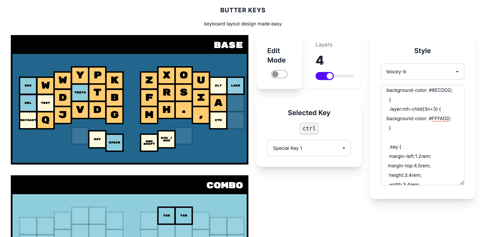
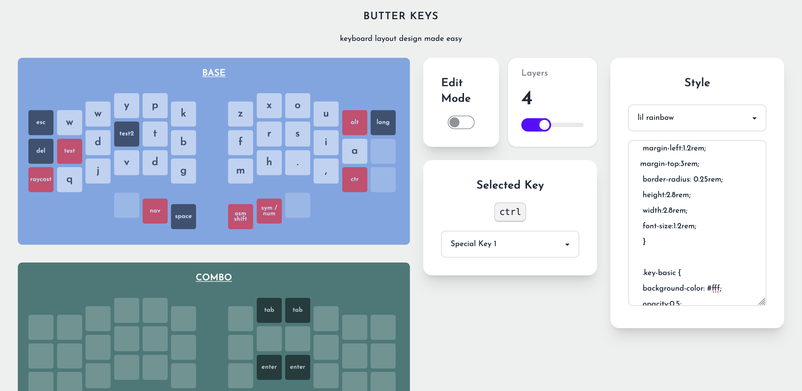
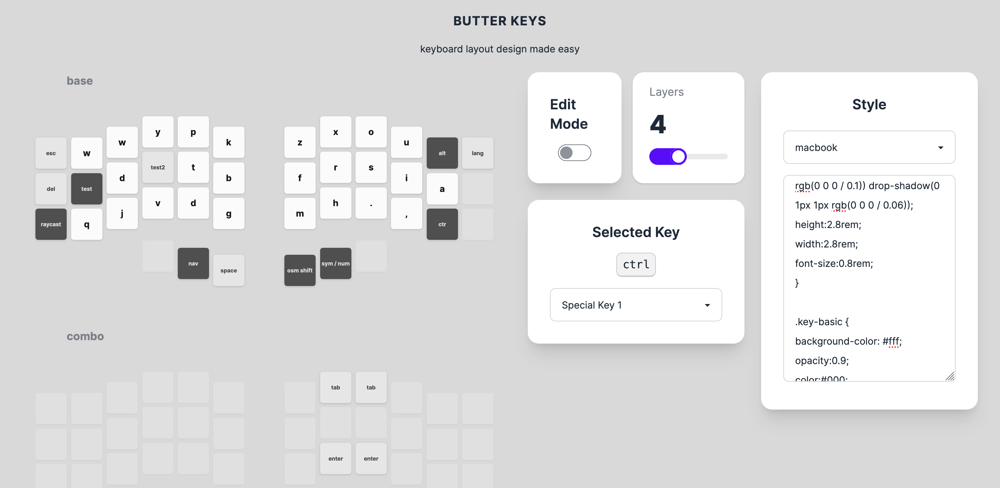
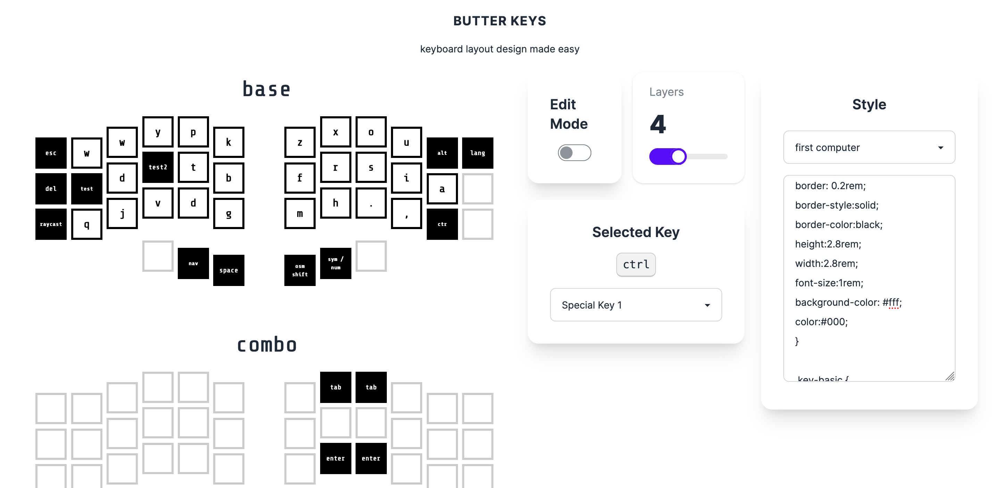

# live demo

https://jaroslaw-weber.github.io/keyfab/

# what is this project

this project is for quickly creating good looking custom keyboard layout designs.

video preview: 

https://github.com/jaroslaw-weber/keyfab/assets/9774233/9149cab3-b6c1-4445-9361-9eb940062a59


screenshots:






it's similar concept as http://www.keyboard-layout-editor.com/ but more easy to use.

# features

## physical layout
- predefined layouts (piantor/moonlander) keyboard types
- change physical layout of the keyboard with shortcuts
- import/export layouts

## input mode
- quick label input (just click and type)
- speed up with "select on focus" and "tab to next key" features

## global style
- endless flexibility in styling (use css to create custom styles)
- ready to use styles
- edit layer name
- change layer count
- batch change key style
- custom fonts through css

# todo
- add tutorial on how to setup custom key shape
- more keyboard types (currently only supports piantor 42 key split layout)
- export/import style
- share keyboard layout with url
- sharing layouts
- changing layer order
- update video showcase


## dev mode on local machine

Run: 

```bash
npm run dev
```

Open [http://localhost:3000](http://localhost:3000) with your browser to see the result.
