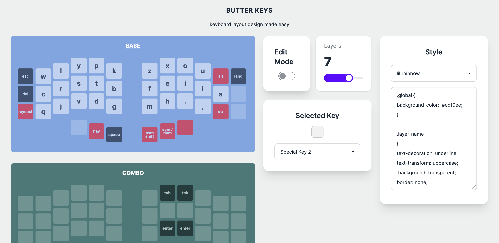
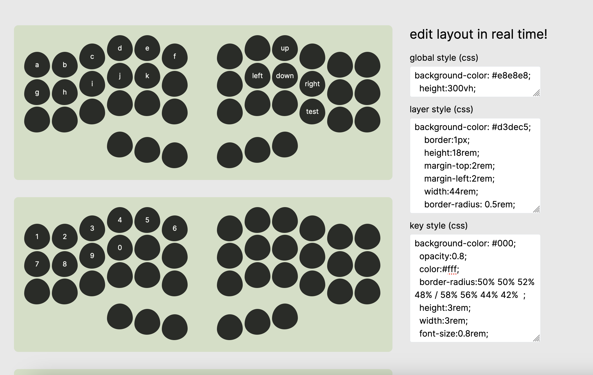

# what is this project

this project is for creating custom keyboard layout designs.

it's basically same concept as http://www.keyboard-layout-editor.com/ but more easy to use.






## Getting Started

First, run the development server:

```bash
npm run dev
```

Open [http://localhost:3000](http://localhost:3000) with your browser to see the result.
